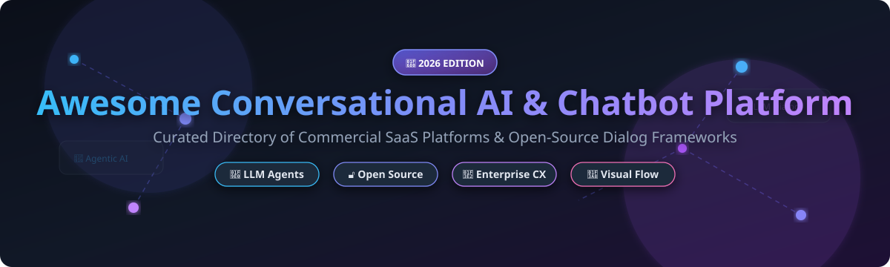

# Awesome-Conversational-AI-Chatbot-Platform

# Awesome-Conversational-AI-Chatbot-Platform 🤖 💬



  





  
  
  
  
  
  



---

## 🌟 Top Conversational AI & Chatbot Platform Ecosystem

**Curated List of Commercial Chatbot Platforms & Open-Source Conversational AI Frameworks**  
*Focused on Intent Recognition, LLM-Powered Agents, Visual Flow Builders, Multi-Channel Deployment & Self-Hosted Dialog Systems*

**Last updated: October 2026** 📅

---

### 📌 Overview & SEO Summary
Welcome to the ultimate curated directory of **conversational AI platforms**, **open-source chatbot frameworks**, and **dialog management systems**. Whether you are looking for enterprise-grade commercial solutions (such as *Amazon Lex*, *Google Dialogflow*, and *Kore.ai*), or self-hostable open-source alternatives (like *Rasa*, *Botpress*, and *AstrBot*), this list covers category leaders, LLM integration, and privacy-respecting conversational infrastructure.

**Key Market Context:**
- **Rasa** is the **most popular open-source conversational AI framework**, with **25M+ downloads** and **enterprise-grade on-premises deployment** capabilities .
- **Botpress** provides a **visual flow builder** with **built-in NLU and multi-channel deployment**, making it accessible for both technical and non-technical teams .
- **AstrBot** is an **emerging open-source all-in-one Agent chatbot platform** integrating with **mainstream instant messaging apps** like QQ, WeChat, Telegram, Slack, and Discord .

---

## 📑 Table of Contents
- [🏢 SaaS & Commercial Platforms](#-saas--commercial-platforms)
- [🔓 Open-Source GitHub Projects](#-open-source-github-projects)
- [🛠️ How to Contribute](#%EF%B8%8F-how-to-contribute)
- [📊 Star History](#-star-history)
- [🤝 Support & Sponsorship](#-support--sponsorship)
- [⚠️ Disclaimer](#%EF%B8%8F-disclaimer)

---

## 🏢 SaaS / Commercial Platforms

The conversational AI market spans **hyperscaler bot services** (Amazon Lex, Google Dialogflow, Azure Bot Service) that provide **deep cloud integration and managed NLU**, **enterprise conversational AI platforms** (Kore.ai, Cognigy, Yellow.ai) that offer **agentic automation and contact-center integration**, and **CX-focused chatbot platforms** (Ada, boost.ai) that emphasize **autonomous resolution and support automation**. Pricing models vary: **Kore.ai** uses subscription tiered by interactions/sessions with modular add-ons, **Cognigy** is bundled within NICE CXone Mpower at premium tier, **Yellow.ai** charges per conversation or automated resolution, and **Ada** uses a platform fee plus conversation-based usage .

| SaaS / Commercial Platform | Company / Owner | Valuation / Market Cap | Standard Edition Starting Price | Free Tier / Free Trial Limits | Description |
| :--- | :--- | :--- | :--- | :--- | :--- |
| **[Amazon Lex](https://aws.amazon.com/lex/)** ☁️ | Amazon | ~$2.0 Trillion | **Pay-per-request** based on text or speech requests | **Free tier: 10,000 text requests + 5,000 speech requests/month for 12 months** | **AWS-native conversational AI** — **Automatic Speech Recognition (ASR) and Natural Language Understanding (NLU)** for building conversational interfaces . **Integrates with Lambda, Connect, and Comprehend**. **Deep integration with AWS ecosystem** for voice and chat bots. |
| **[Google Cloud Dialogflow](https://cloud.google.com/dialogflow)** 🌐 | Google (Alphabet) | ~$2.0 Trillion | **Pay-per-request**; **CX Agent Studio** powered by Gemini for enterprise | **Free tier: limited requests** | **GCP-native conversational AI** — **Dialogflow CX became "Flows"** as of March 2026, with **CX Agent Studio** introduced as a distinct Gemini-powered service . **Visual interface** to build, evaluate, deploy, and monitor **multimodal agents in 40+ languages** . **MCP support** at API level. |
| **[Microsoft Azure Bot Service](https://azure.microsoft.com/en-us/products/ai-services/ai-bot-service)** 🔷 | Microsoft | ~$3.90 Trillion | **Pay-per-message**; **Copilot Studio** for no-code builds | **Free tier: 10,000 messages/month** | **Azure-native bot platform** — **Bot Framework SDK** (C#/Node.js) for full-code control, **Power Virtual Agents (Copilot Studio)** for no-code builds . **Widest native channel hub** via Azure Bot Service — Skype, Teams, Cortana, Web Chat, and more . **Adaptive Dialogs** for dynamic conversation flows . |
| **[IBM watsonx Assistant](https://www.ibm.com/products/watsonx-assistant)** 🔵 | IBM | ~$200 Billion | **Custom enterprise pricing** | **Free tier: Lite plan available** | **Enterprise conversational AI** — **Watson Assistant folded into watsonx Orchestrate** . **On-premises deployment** available in Enterprise version . **Analytics for users, conversations, and requests**, with intent recognition and completion tracking . |
| **[Kore.ai](https://kore.ai/)** 🎯 | Kore.ai | Private | **Subscription tiered by interactions/sessions**; modular add-ons  | **Free trial available** | **Enterprise CAI platform** — **Gartner 2025 Leader** for Conversational AI . **Technology-agnostic** — bring your own LLM, NLU, and speech providers. **Pre-built vertical accelerators** for banking, healthcare, and retail. **AI for Service and AI for Work** modules . |
| **[NICE Cognigy](https://www.cognigy.com/)** 🧠 | NICE (Acquired 2025) | ~$10 Billion | **Subscription — capacity/sessions**; bundled within CXone Mpower  | **Free trial available** | **Contact-center embedded conversational AI** — **Gartner 2025 Leader** with deep contact-center DNA . **Low-code conversational and agentic AI** for voice and chat. **Agent simulation/testing, multilingual coverage, and orchestration** across front and back office . |
| **[Yellow.ai](https://yellow.ai/)** 💛 | Yellow.ai | Private | **Subscription or usage** — per conversation/automated resolution, by channel  | **Free trial available** | **CX/EX automation platform** — **Agentic automation across 35+ channels**. **Orchestrator LLM** routes between knowledge retrieval, flows, and live-agent handoff **without per-intent training**. **Multi-LLM architecture** picks among models per task . |
| **[Ada Support](https://www.ada.cx/)** 🟢 | Ada | Private | **Platform fee + usage** (conversation-based; historically per-resolution)  | **No free tier**; demo required | **Outcome-led CX automation** — **AI customer-service agent built for autonomous resolution** with tight loop of measurement, tuning, and reporting around containment . **Clean fit with Zendesk/Salesforce-centric support stacks**. **Highest reported coverage (19%)** in mid-April 2026 AI agent platform comparison . |
| **[boost.ai](https://boost.ai/)** ⚡ | boost.ai | Private | **Custom enterprise pricing** | **Demo available** | **Enterprise conversational AI** — **Predictable answers, good handoff to live agents, and clear reporting** . **Best for customer support automation** where top intents are well-defined and content is maintained . **Nordic-focused with strong European presence**. |
| **[Botpress Cloud](https://botpress.com/)** 🎨 | Botpress | Private | **Pay-as-you-go** with AI Spend charges | **Free tier available** | **Open-source chatbot platform** — **Visual flow builder, built-in NLU, knowledge bases, and multi-channel deployment** (web, WhatsApp, Slack, etc.) . **Uses LLMs for natural conversation** while maintaining structured workflows. **Generous free tier for getting started** . |

---

## 🔓 Open-Source GitHub Projects

*Sorted by GitHub_Stars_Count (Descending)* 🌟

- **[Rasa](https://github.com/RasaHQ/rasa)**   
  **The most popular open-source conversational AI framework**, Apache-2.0 licensed (core); **Rasa Pro** is open-core with commercial features. **25M+ downloads** — **the enterprise standard for open-source conversational AI** . **Flows for business logic** — simplified way to describe how the AI assistant should handle conversations . **Automatic Conversation Repair** handles interruptions and unexpected inputs . **LLM integration** for contextually aware and agentic interactions. **Robustness and control** — prevents prompt injection and hallucinations . **Built-in security** with secrets management via Pulumi and HashiCorp Vault integration . **Runs entirely on-premises** — the only conversational AI platform that supports full on-prem deployment due to its open-source nature . **Free developer license** available; paid license for larger-scale production . **The definitive open-source conversational AI framework**. 🏛️

- **[Botpress](https://github.com/botpress/botpress)**   
  **Open-source platform for building AI-powered chatbots and agents**, MIT licensed. **Visual flow builder** — drag-and-drop conversation design . **Built-in NLU, knowledge bases, and multi-channel deployment** (web, WhatsApp, Slack, etc.) . **Uses LLMs for natural conversation** while maintaining structured workflows. **Plugin and integration ecosystem**. **Self-hosted option** for full customization . **Suitable for both simple FAQ bots and complex enterprise automation** . **The most accessible open-source chatbot platform** for developers and business users alike. 🎨

- **[AstrBot](https://github.com/AstrBotDevs/AstrBot)**   
  **Open-source all-in-one Agent chatbot platform**, Apache-2.0 licensed. **Integrates with mainstream instant messaging apps** — QQ, WeChat Work, Feishu, DingTalk, WeChat Official Accounts, Telegram, Slack, Discord, LINE, KOOK, and more . **AI LLM Conversations, Multimodal, Agent, MCP, Skills, Knowledge Base, Persona Settings, Auto Context Compression** . **Supports integration with Dify, Alibaba Cloud Bailian, and Coze** agent platforms . **1000+ plugins** for one-click installation . **Agent Sandbox** for isolated, safe execution of code and shell calls . **WebUI and Web ChatUI support**. **Multi-model support** — OpenAI, Anthropic, Gemini, Ollama, and many more . **The most comprehensive open-source IM-integrated chatbot platform**. 🤖

- **[Microsoft Bot Framework SDK](https://github.com/microsoft/botframework-sdk)**   
  **Open-source SDK for building bots**, MIT licensed. **Bot Builder SDK v4** for **Node.js, C#, and REST API** . **Adaptive Dialogs** enable conversations that can be **dynamically changed as the conversation progresses** — insert new steps or sub-dialogs on the fly . **Language Generation** extracts embedded strings from code and manages them through a runtime and file format . **Common Expression Language** powers both adaptive dialogs and language generation . **Channel and Adapter system** connects bots to **Skype, Teams, Cortana, Web Chat, Facebook, Slack, Telegram, and more** . **Deep integration with Azure Bot Service** for hosting and scaling . **The most enterprise-integrated open-source bot framework** — ideal for organizations in the Microsoft ecosystem. 🏢

- **[ChatterBot](https://github.com/gunthercox/ChatterBot)**   
  **Machine learning-based conversational dialog engine**, BSD-3-Clause licensed. **Lightweight and Python-native** — build a basic conversation system in **30 lines of code** . **Training data driven** — import corpus for rapid knowledge base construction. **TF-IDF algorithm** for matching similar questions. **Low-code development** with Python API . **Limitation**: requires domain adaptation layer for professional conversations — with BioBERT, medical diagnosis accuracy improved from 62% to 89% . **The simplest entry point to open-source conversational AI** — ideal for education and simple Q&A systems. 🐍

- **[Open WebUI](https://github.com/open-webui/open-webui)**   
  **Self-hosted ChatGPT-style UI**, MIT licensed. **124K+ GitHub stars, 282M+ downloads** — **the de-facto self-hosted AI chat platform** . **Runs entirely offline** — supports **Ollama, OpenAI-compatible APIs, MCP servers, RAG with 9+ vector databases, voice I/O, and multi-user RBAC** . **Multi-user RBAC, LDAP/SSO, audit-friendly architecture** . **Genuinely enterprise-grade** — RBAC, SSO, multi-user from day one . **Pairs perfectly with Ollama** for local-only AI . **The most deployed self-hosted ChatGPT clone** — ideal for privacy-conscious teams and regulated industries . 🔒

- **[Flowise](https://github.com/FlowiseAI/Flowise)**   
  **Drag-and-drop LLM app builder**, Apache-2.0 licensed. **Visual editor for chatbots, agents, and multi-agent workflows**. **Self-host free** — Cloud metered by predictions. **Model-agnostic** — supports multiple LLM providers. **The most accessible visual builder for LLM-powered conversational agents** . 🎯

- **[Dify](https://github.com/langgenius/dify)**   
  **LLMOps platform with agentic workflows**, Apache-2.0 licensed. **Visual workflow builder** combining LLM nodes, knowledge retrieval, tools, and conditional logic. **Self-hosted or Dify Cloud**. **RAG pipeline and agent nodes** for conversational AI applications. **The most complete open-source LLMOps platform** . 🎨

---

## 🛠️ How to Contribute

Contributions are welcome! Follow these steps to submit new conversational AI platforms or open-source chatbot software:

1. 🍴 **Fork** the repository.
2. 📝 **Add/edit** entries in `README.md` maintaining table/list structure and formatting.
3. 🔗 Include project title, official website/GitHub link, exact Stars_Count, license, and brief description.
4. 🚀 Submit a **Pull Request** with a descriptive summary of your changes.

---

## 📊 Star History



---

## 🤝 Support & Sponsorship

If you find this conversational AI repository useful, please consider supporting the project:

- ⭐ **Star** this repository to increase visibility!
- 🔀 **Fork** and share with fellow developers, CX teams, and open-source advocates.
- ☕ **Sponsor & Buy Me a Coffee**: Support ongoing open-source curation via the [GitHub Sponsor Dashboard](https://github.com/sponsors/ishandutta2007).

---

## ⚠️ Disclaimer

- This is a **community-curated** list — not exhaustive and not an endorsement. ℹ️
- **Rasa is the only conversational AI platform that can run fully on-premises** due to its open-source nature — critical for regulated industries with data sovereignty requirements . **Botpress offers self-hosted options** with a visual flow builder . **AstrBot provides IM-native deployment** with 1000+ plugins .
- **The category is mid-pivot from intent-based chatbots to LLM-grounded, agentic assistants** — the contact-center and conversational-AI worlds are merging. **Differentiator is shifting from NLU accuracy** (now commoditized by foundation models) **to whose platform can ground, govern, and prove autonomous resolution at enterprise scale** .
- **Open-source conversational AI tools are not turnkey** — **Rasa requires Python and ML expertise** . **Botpress requires deployment and configuration**. **AstrBot requires server setup**. **Always validate conversation flows and security with a proof-of-concept** before production deployment. 🤖

---



  <b>Made with ❤️ for developers, CX teams, and open-source conversational AI advocates.</b>

